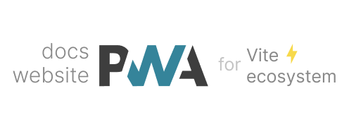

 
Documentation: PWA integrations for Vite and the ecosystem

 

 

  

## 🚀 Features

- 📖 [**Documentation & guides**](https://vite-pwa-org.netlify.app/)
- 👌 **Zero-Config**: sensible built-in default configs for common use cases
- 🔩 **Extensible**: expose the full ability to customize the behavior of the plugin
- 🦾 **Type Strong**: written in [TypeScript](https://www.typescriptlang.org/)
- 🔌 **Offline Support**: generate service worker with offline support (via Workbox)
- ⚡ **Fully tree shakable**: auto inject Web App Manifest
- 💬 **Prompt for new content**: built-in support for Vanilla JavaScript, Vue 3, React, Svelte, SolidJS and Preact
- ⚙️ **Stale-while-revalidate**: automatic reload when new content is available
- ✨ **Static assets handling**: configure static assets for offline support
- 🐞 **Development Support**: debug your custom service worker logic as you develop your application
- 🛠️ **Versatile**: integration with meta frameworks: [îles](https://github.com/ElMassimo/iles), [SvelteKit](https://github.com/sveltejs/kit), [VitePress](https://github.com/vuejs/vitepress), [Astro](https://github.com/withastro/astro), [Nuxt 3](https://github.com/nuxt/nuxt) and [Remix](https://github.com/remix-run/remix)
- 💥 **PWA Assets Generator**: generate all the PWA assets from a single command and a single source image
- 🚀 **PWA Assets Integration**: serving, generating and injecting PWA Assets on the fly in your application

## 📦 Integrations

- [îles](https://github.com/ElMassimo/iles/tree/main/packages/pwa): documentation can be found [here](https://iles-docs.netlify.app/guide/pwa)
- [SvelteKit](https://github.com/vite-pwa/sveltekit)
- [VitePress](https://github.com/vite-pwa/vitepress)
- [Astro](https://github.com/vite-pwa/astro)
- [Nuxt 3](https://github.com/vite-pwa/nuxt)
- [Remix](https://github.com/remix-run/remix)

## 📄 License

[MIT](./LICENSE) License &copy; 2021-PRESENT [Anthony Fu](https://github.com/antfu)
